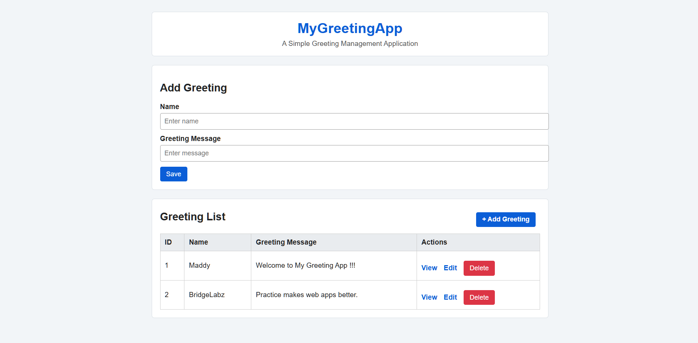

# BridgeLabz Backend Refresher Training

**Duration:** 31 July 2026 – 29 August 2026  
**Program:** Backend Refresher Training (Java)

## About This Repository

This repository contains my daily assignments, practice work, notes, and application development tasks completed during the BridgeLabz Backend Refresher Training Program.

---
## Training Coverage

| Phase | Topics |
|---------|---------|
| Database Programming | ☑ DBMS Fundamentals & RDBMS Basics<br>☑ ER Diagram, Indexing & Normalization<br>☑ Joins, Stored Procedures & Triggers<br>☑ JDBC & Health Clinic Application |
| Backend Fundamentals | ☑ Tomcat & Servlets<br>☑ Spring Framework Fundamentals<br>☑ Spring MVC<br>☐ REST APIs & Request Handling<br>☐ API Testing Tools & SDLC |
| Spring Boot Development | ☐ Spring Boot Fundamentals<br>☐ Dependency Injection & H2 Database<br>☐ Spring Services<br>☐ Spring JPA & Spring JDBC<br>☐ Logging, Maven & Postman |
| Advanced Backend Development | ☐ Spring Security & JWT Authentication<br>☐ Authorization & Notes Management<br>☐ Search, Filter & Tags Management<br>☐ JMS & Redis Caching<br>☐ RabbitMQ & Spring Batch<br>☐ Exception Handling, AOP & Spring Cloud |
| Microservices Architecture | ☐ Monolith vs Microservices<br>☐ API Gateway<br>☐ Service Registry (Eureka)<br>☐ Microservices Architecture & Integration |

---

## Repository Structure

```text
BridgeLabz-Training/
│
├── Day-1/
│   ├── day1_practice.sql
│   └── assignment.sql
│
├── Day-2/
│   ├── day2_assignment.sql
│   └── health_clinic_schema.sql
│   └── ER-Diagram.png
|
├── Day-3/
│   └── day3_practice.sql
|
├── Day-4/
│   └── HealthClinicApp/
|
├──Day-5/
|   └──MyGreetingApp/
|    
│
├── Day-/
│
├── ...
│
└── README.md
```

---

## Daily Activity Log

### Day 1 — 31-07-2026

## Focus Area - DBMS Fundamentals & RDBMS Basics

- Learned database fundamentals and DBMS architecture
- Understood the differences between File Systems, DBMS, and RDBMS
- Explored SQL vs NoSQL databases and their use cases
- Studied MySQL architecture and environment setup
- Practiced DDL and DML commands
- Installed and configured MySQL Server and MySQL Workbench
- Completed SQL practice exercises and assigned tasks

---

### Day 2 — 03-08-2026

## Focus Area - ER-Diagram, Indexing & Normalization

**Topics Covered**
- ER Diagram Fundamentals
- Entities, Attributes & Relationships
- Cardinality and Participation Constraints
- Primary Keys & Foreign Keys
- Database Normalization (1NF, 2NF, 3NF, BCNF)
- Indexing Concepts and B+ Tree Structure
- Clustered, Non-Clustered, Composite & Covering Indexes
- Query Optimization and Execution Plans

**Practiced**
- Designed and refined the Health Clinic database schema
- Implemented One-to-Many and Many-to-Many relationships
- Created `patient_phones` table to support multiple phone numbers
- Created `doctor_specializations` and `doctor_room` junction tables
- Added `rooms` table and mapped doctors to consultation rooms
- Applied normalization principles to eliminate redundancy
- Created single-column, composite, and covering indexes
- Analyzed query performance using `EXPLAIN`

---

### Day 3 — 04-08-2026

## Focus Area - SQL Joins, Stored Procedures & Triggers

**Topics Covered**
- SQL Join Operations
- INNER, LEFT, RIGHT, FULL OUTER, SELF & CROSS Joins
- Multi-Table Joins
- Stored Procedures
- IN, OUT & INOUT Parameters
- Transaction Management
- Error Handling in Procedures
- Database Triggers
- BEFORE and AFTER Triggers

**Practiced**
- Retrieved clinic data using different join operations
- Generated reports using multi-table joins
- Created stored procedures with parameter handling
- Implemented transaction control using COMMIT and ROLLBACK
- Added error handling using EXIT HANDLER
- Created triggers for data validation and activity logging
- Automated billing and visit history updates through triggers
- Enforced business rules and data integrity at the database level

---
### Day 4 — 05-08-2026

## Focus Area - JDBC & Health Clinic Console Application

**Topics Covered**
- JDBC fundamentals and database connectivity
- Maven project setup for Java applications
- MySQL connection handling using JDBC
- DAO design pattern for database operations
- DTO classes for transferring data
- Service layer for business logic
- HikariCP connection pooling
- Console-based interactive menu development

**Practiced**
- Created a complete Health Clinic Management Console App
- Connected Java application with MySQL database
- Implemented patient, doctor, specialization, appointment, billing, and visit history modules
- Added CRUD operations using DAO classes
- Used prepared statements for safer SQL execution
- Added appointment booking and cancellation features
- Implemented appointment completion with billing and visit history
- Organized the project using config, dao, dto, service, and ui packages
- Added a simple project README with setup and run instructions
#### The project structure is as follows: 
```
├── Day-4/
│   └── HealthClinicApp/
│       ├── database/
│       │   └── health_clinic_schema.sql
│       ├── src/main/java/com/clinic/
│       │   ├── config/
│       │   │   └── HikariConnectionPool.java
│       │   ├── dao/
│       │   │   ├── impl/
│       │   │   └── DAO interfaces
│       │   ├── dto/
│       │   │   └── Data model classes
│       │   ├── service/
│       │   │   └── AppointmentService.java
│       │   ├── ui/
│       │   │   └── ConsoleMenu.java
│       │   └── Main.java
│       ├── pom.xml
│       └── README.md

```
---

### Day 5 - 06-08-2026

## Focus Area - Spring MVC Fundamentals

**Topics Covered**
- Spring MVC Architecture
- Tomcat Servlet
- Spring IOC
- Dependency Injection
- Spring vs Spring Boot
- Model
- View
- Controller
- Request Lifecycle

**Practiced**
- Created `MyGreetingApp`, a beginner greeting web application
- Built an HTML form to accept the user's name
- Added `GreetingServlet` to handle form submission
- Used `request.getParameter()` to read form data
- Used request attributes to pass data from Servlet to JSP
- Used `greeting.jsp` as the view to display a personalized greeting
- Understood the MVC-style flow: Client Request -> Tomcat -> Servlet -> JSP -> Response
- Packaged the application as `MyGreetingApp.war` using Maven
- Added screenshots and setup instructions in `Day-5/README.md`

#### The project structure is as follows:
```
├── Day-5/
│   ├── README.md
│   ├── screenshots/
│   │   ├── home-page.png
│   │   └── old-result-page.png
│   └── MyGreetingApp/
│       ├── pom.xml
│       └── src/main/
│           ├── java/com/greetings/
│           │   └── GreetingServlet.java
│           └── webapp/
│               ├── index.html
│               ├── greeting.jsp
│               ├── css/styles.css
│               └── WEB-INF/web.xml
```

---

### Day-06: 07-08-26

## Focus Area - Spring MVC CRUD Application

**Topics Covered**
- Spring MVC Architecture
- Tomcat Servlet
- Spring IOC
- Dependency Injection
- Spring vs Spring Boot
- Model, View, and Controller
- DispatcherServlet
- Request Lifecycle

### Project: MyGreetingApp

Built a simple Spring Boot MVC CRUD application to manage greeting messages using Thymeleaf.

### Key Concepts Practiced

- **Spring MVC Architecture** - Follows the Model-View-Controller pattern to separate application logic.
- **DispatcherServlet** - Front controller that receives requests and routes them to the appropriate controller.
- **Controller (`@Controller`)** - Handles HTTP requests and prepares data for the view.
- **Views (Thymeleaf)** - Dynamic HTML templates used to render responses.
- **`@GetMapping`** - Maps HTTP GET requests to controller methods.
- **`@PostMapping`** - Maps form submissions to controller methods.
- **`@RequestParam`** - Retrieves form values from the request.
- **Model** - Passes data from the controller to the view.
- **Request Lifecycle** - Client Request -> DispatcherServlet -> Controller -> Model -> View -> Response.

### MyGreetingApp

- Created a Spring Boot MVC application named `MyGreetingApp`.
- Configured the application using `@SpringBootApplication`.
- Implemented `GreetingController` with:
  - `GET /` - Displays the add greeting form and greeting list.
  - `POST /greetings` - Saves a new greeting.
  - `GET /greetings/{id}` - Displays one greeting.
  - `GET /greetings/{id}/edit` - Opens the edit form.
  - `POST /greetings/{id}` - Updates an existing greeting.
  - `POST /greetings/{id}/delete` - Deletes a greeting.
- Used Thymeleaf templates to render dynamic content.
- Used an in-memory repository to store greeting records.
- Gained hands-on experience with the complete Spring MVC CRUD request flow.

#### Project Screenshots

**Home Page**



**Greeting Details Page**


**Edit Greeting Page**


---

### Day 7 - 10-08-2026

## Focus Area - Spring REST API and Request Handling

**Topics Covered**
- Spring Boot REST API
- RESTful API request handling
- `@RestController`, `@RequestMapping`, `@PostMapping`, and `@RequestBody`
- Spring Data JPA and Hibernate
- Entity, Repository, Service, and Controller layers
- DTO Pattern
- H2 In-Memory Database
- H2 Database Console
- HikariCP Connection Pool

**Project: Contacts Management REST API**

Built a Contacts Management REST API using Spring Boot, Spring Data JPA, Hibernate, and H2 Database.

**Key Concepts Practiced**
- Implemented the Add Contact API using POST.
- Followed layered architecture: Controller -> Service -> Repository -> Database.
- Created `Contact` entity for database mapping.
- Used Request DTO and Response DTO for clean API data transfer.
- Configured H2 in-memory database and H2 Console.
- Used `JpaRepository` for database operations.
- Tested the API using Postman.

**API Implemented**
- `POST /contactApp/create` - Adds a new contact


#### The project structure is as follows:
```text
Day-7/
`-- ContactsApp/
    |-- pom.xml
    `-- src/
        |-- main/
        |   |-- java/
        |   |   `-- com/bridgelabz/contactsapp/
        |   |       |-- ContactsAppApplication.java
        |   |       |-- controller/
        |   |       |   `-- ContactAppController.java
        |   |       |-- dto/
        |   |       |   |-- ContactRequestDTO.java
        |   |       |   `-- ContactResponseDTO.java
        |   |       |-- model/
        |   |       |   `-- Contact.java
        |   |       |-- repository/
        |   |       |   `-- ContactRepository.java
        |   |       `-- service/
        |   |           `-- ContactService.java
        |   `-- resources/
        |       `-- application.properties
        `-- test/
            `-- java/com/bridgelabz/contactsapp/
                `-- ContactsAppApplicationTests.java
```

---


## Maintained By

**Madhu Solanki**

Updated daily to reflect ongoing learning.
